# 🎮 Roblox Survival Game - Dev Diary

> Documenting daily game progress, screenshots, and gameplay footage by **[@erdongsam](https://x.com/erdongsam)**.  
> 🌐 **Interactive Devlog Website**: [https://samobviously.github.io/RobloxGameDevelopment/](https://samobviously.github.io/RobloxGameDevelopment/)

---

## 🎮 Day 1 (Aug 15, 2026): Project Launch & Core Survival Systems

Day 1 of documenting my Roblox survival game! 🎮  
I'm already a few weeks into development, and I have completed the **GUI, animals/mobs, crafting mechanics, shovel, hotbar, and tools**.

### 📸 Screenshots

  
  

  
  

- **Key Updates:**
  - Designed custom survival GUI, health/hunger gauges, and HUD
  - Implemented inventory hotbar with quick-select tool slots
  - Added wild animals with roaming and detection mechanics
  - Created recipe-based Crafting system and tool interactions
- **Tags:** `#RobloxDev` `#ProjectLaunch` `#GUI` `#Hotbar` `#Animals` `#SurvivalGame`

---

## 🌲 Day 2 (Aug 16, 2026): Resource Gathering, Axes & Spades

Today was all about the resource grind! 🌲⚒️  
I just fully implemented **Axes and Spades**! Players will progress through 4 different crafting tiers for each weapon: **Stone, Copper, Iron, and Titanium** *(currently starting with Stone tier)*.

### 🎥 Gameplay Footage

  
  

- **Raw Video Files:**
  - 🪓 [Download Axe Tree Chopping Video (.mp4)](public/footage/day-2-axes-spades-harvesting.mp4)
  - ⛏️ [Download Spade Digging Video (.mp4)](public/footage/day-2-resource-tier-progression.mp4)
- **Key Updates:**
  - Implemented tree chopping and wood harvesting mechanics with Axes
  - Implemented terrain digging and resource gathering with Spades
  - Configured 4-tier crafting progression system (Stone, Copper, Iron, Titanium)
  - Added tool hit feedback, swinging animations, and particle effects
- **Tags:** `#RobloxDev` `#ResourceGrind` `#Crafting` `#Tools` `#Axes` `#Spades`

---

## 🌊 Day 3 (Aug 17, 2026): Deep Cold Ocean & Cave System

Expanding the map today! 🌊❄️  
I just finished implementing two brand-new biomes: the **Deep Cold Ocean** (complete with brand new mobs) and an **underground Cave system**.

### 📸 Screenshots

  
  

- **Key Updates:**
  - Implemented Deep Cold Ocean biome with custom underwater atmosphere and fog
  - Added brand new aquatic & cold-ocean mobs
  - Constructed subterranean underground Cave system for exploration
- **Tags:** `#RobloxDev` `#Biomes` `#CaveSystem` `#OceanBiome` `#Mobs`

---

## 🌡️ Day 4 (Aug 18, 2026): Real-Time Temperature UI & Survival Status

Just added a new temperature UI that tracks your comfort in real-time! 🌡️🟡  
Keep an eye on the little yellow face—ignore it, and you'll either freeze to death or catch heat stroke.

### 🎥 Gameplay Footage

  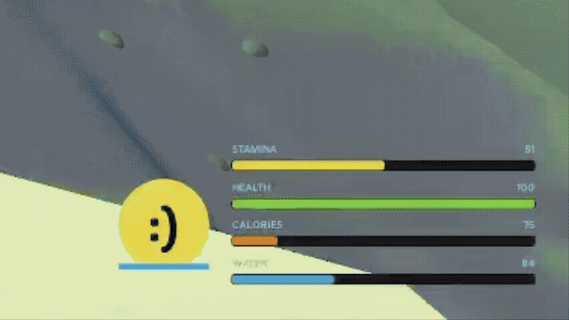
  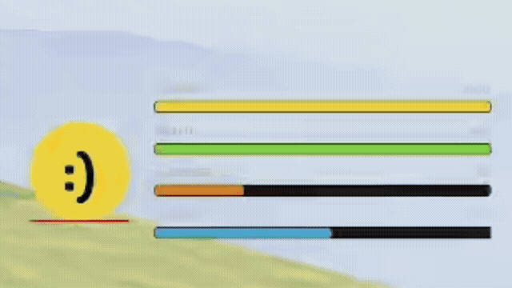

- **Raw Video Files:**
  - 🌡️ [Download Temperature UI Video 1 (.mp4)](public/footage/day-4-1.mp4)
  - 🟡 [Download Temperature UI Video 2 (.mp4)](public/footage/day-4-2.mp4)
- **Key Updates:**
  - Built dynamic temperature meter UI reacting to environmental biomes
  - Created visual status indicators (yellow face comfort expressions)
  - Implemented hypothermia freezing and hyperthermia heat stroke mechanics
- **Tags:** `#RobloxDev` `#TemperatureUI` `#SurvivalMechanics` `#HUD`

---

## 🛠️ Day 5 (Aug 19, 2026): Crafting System Backend & First Recipes Live

Crafting is officially live! 🛠️🚀  
I just finished coding the backend for the crafting system and hooked up the first set of recipes. You can now craft a **Stone Hatchet, Pickaxe, and Shovel**!

### 🎥 Gameplay Footage

  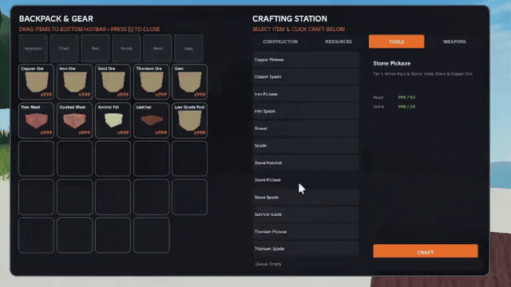
  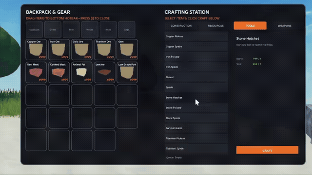

- **Raw Video Files:**
  - ⚒️ [Download Crafting Video 1 (.mp4)](public/footage/day-5-1.mp4)
  - 🪓 [Download Crafting Video 2 (.mp4)](public/footage/day-5-2.mp4)
- **Key Updates:**
  - Engineered backend crafting pipeline and recipe data structures
  - Hooked up initial starter recipes (Stone Hatchet, Pickaxe, Shovel)
  - Validated ingredient consumption and inventory item generation
- **Tags:** `#RobloxDev` `#Crafting` `#Recipes` `#Tools` `#IndieGame`

---

## 🖌️ Day 6 (Aug 20, 2026): Visual Remodel of Pickaxes, Hatchets & Spades

Taking a quick break from scripting today to focus on visuals! 🖌️🔨  
Completely remodeled the **pickaxes, hatchets, and spades** to give them a much cleaner, more tactile survival aesthetic.

### 📸 Screenshots

  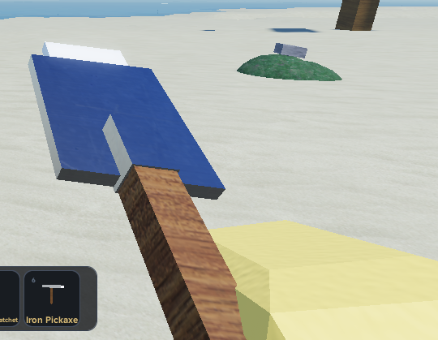
  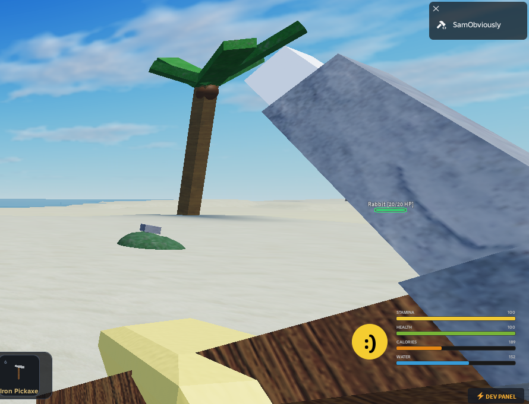
  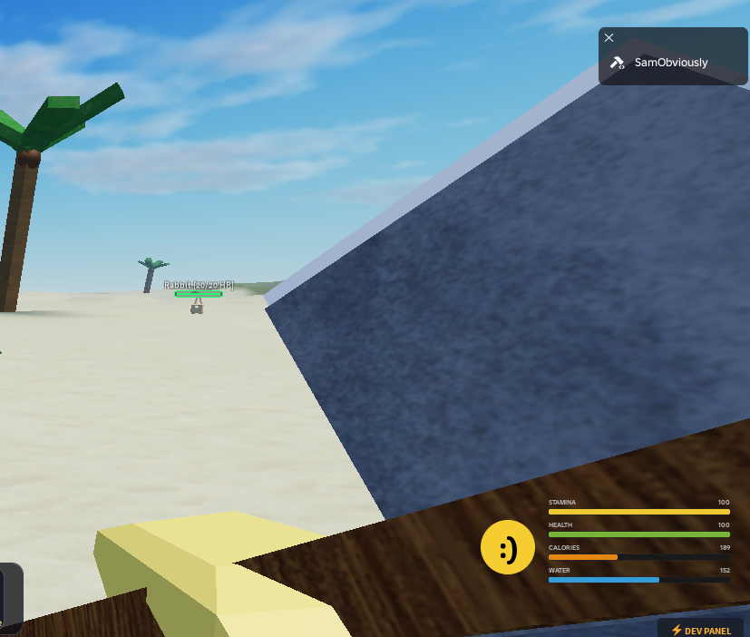

- **Key Updates:**
  - Redesigned 3D model assets for all starter pickaxes
  - Crafted detailed new hatchet & spade meshes
  - Optimized tool scale and grip positioning in character hands
- **Tags:** `#RobloxDev` `#3DModeling` `#Visuals` `#Tools` `#IndieGame`

---

## 🚀 Day 7 (Aug 21, 2026): Gold Tier Tools & 3D Ore Models

Added **Gold tier tools** to the crafting progression today! 🚀✨  
Also finished modeling all the major ores across the world: **Iron, Copper, Gold, Gem, and Titanium**.

### 📸 Screenshots

  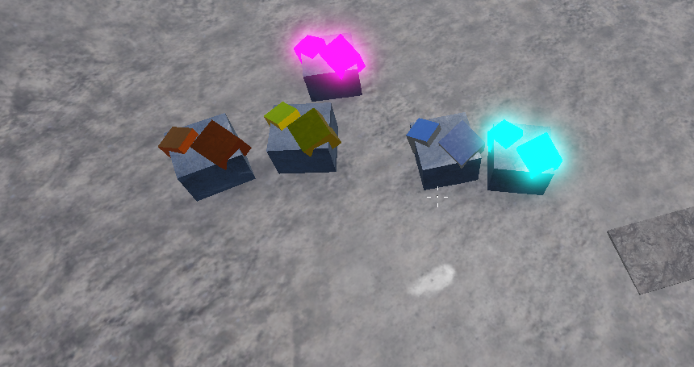
  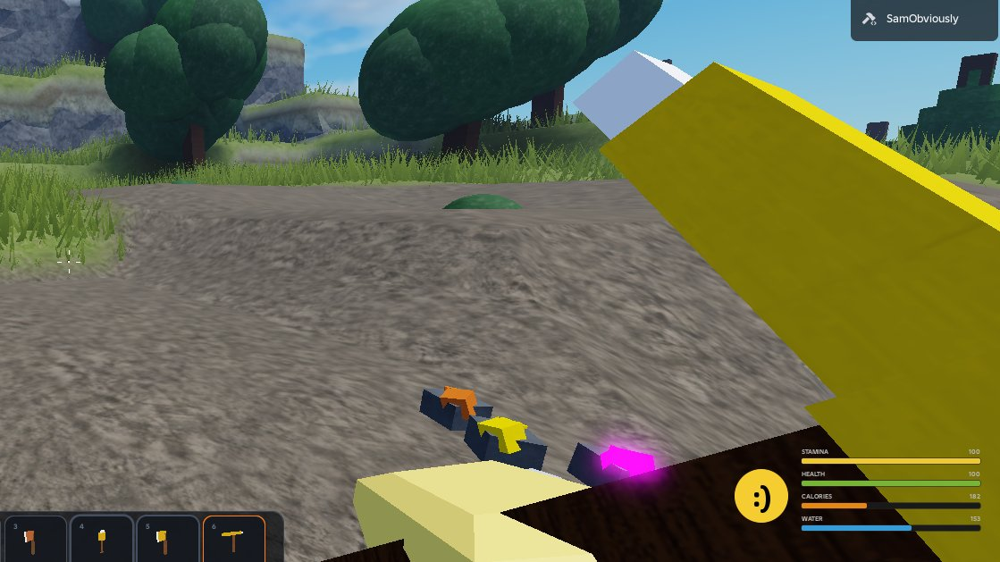

  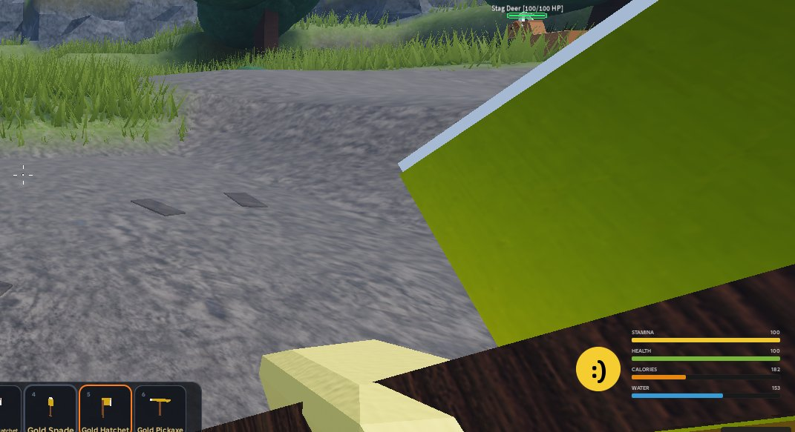
  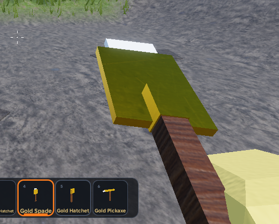

- **Key Updates:**
  - Integrated Gold tool tier with distinct stats and durability
  - Completed 3D models for all ore deposits (Iron, Copper, Gold, Gem, Titanium)
  - Implemented ore node collision and harvestable resource drops
- **Tags:** `#RobloxDev` `#GoldTier` `#Ores` `#Crafting` `#IndieGame`

---

## 🔦 Day 8 (Aug 22, 2026): Dynamic Lighting, Craftable Torches & Steel Tier

Implemented **dynamic lighting with craftable torches** to make cave exploration viable! 🔦🔥  
Also integrated the new **Steel tool tier** to expand the mid-game progression tree.

### 📸 Screenshots

  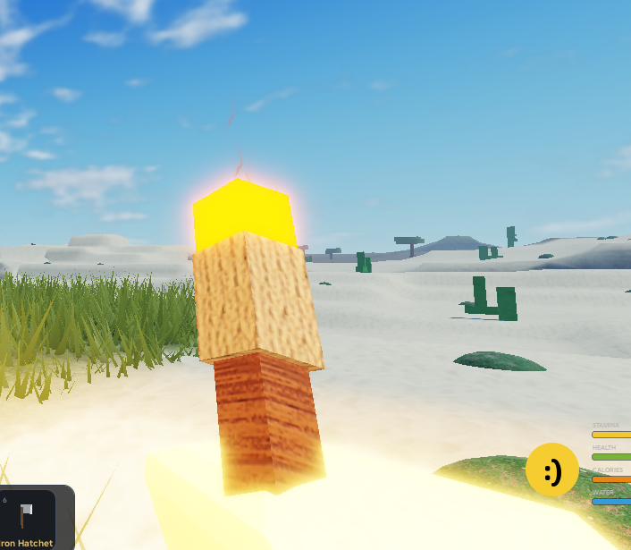
  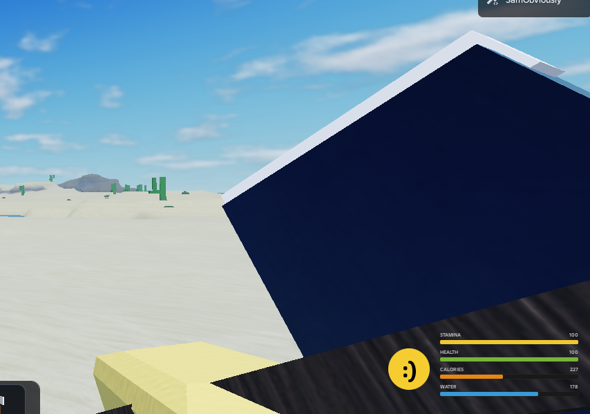

  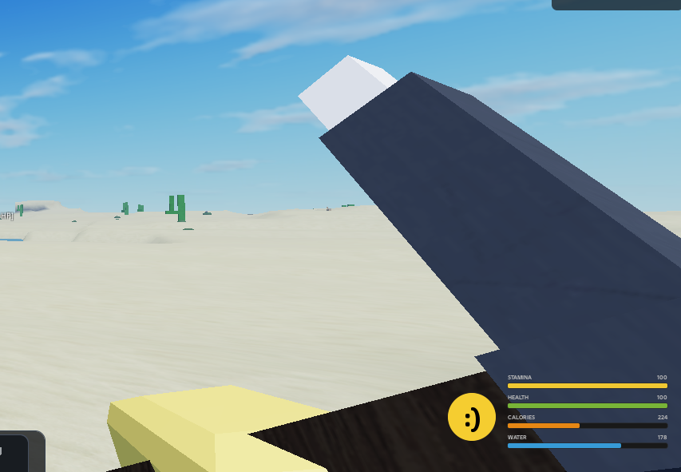
  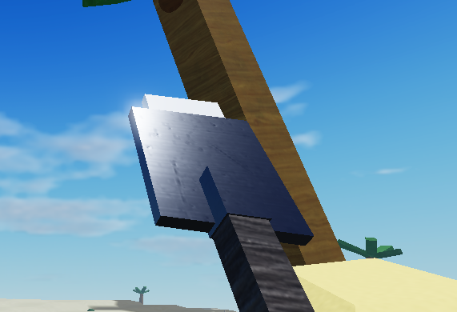

- **Key Updates:**
  - Added craftable handheld Torches with dynamic ambient lighting
  - Implemented realistic shadow casting and light falloff for caves
  - Created Steel tool tier bridging mid-game resource gathering
- **Tags:** `#RobloxDev` `#DynamicLighting` `#Torches` `#SteelTier` `#GameDev`

---

## ⛏️ Day 9 (Aug 23, 2026): Mineable Minerals & Coal Nodes in World Gen

Mineable natural minerals and coal nodes have been successfully added to world generation! ⛏️💎  
The base resource gathering loop is now fully operational.

### 📸 Screenshots

  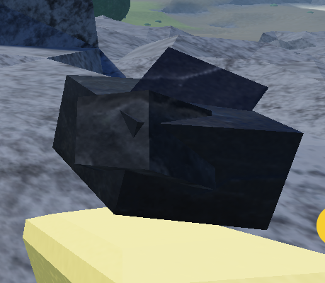
  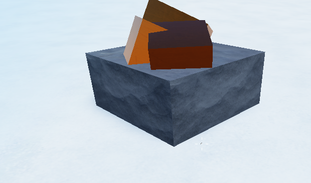

  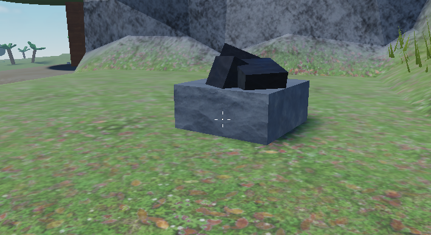
  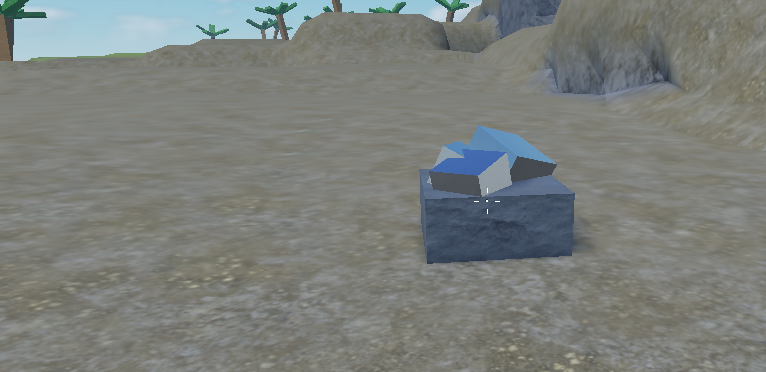

- **Key Updates:**
  - Generated procedural mineral and coal node spawns across the map
  - Connected mining yields to inventory resource economy
  - Balanced tool wear and gathering speeds across different tiers
- **Tags:** `#RobloxDev` `#WorldGen` `#Minerals` `#CoalNodes` `#GameDev`

---

## 🌧️ Day 10 (Aug 24, 2026): Dynamic Weather System & Deep Cold Ocean

Dynamic weather systems are now fully functional! 🌧️⚡  
Bringing changing environmental conditions, rain, and storms to the game world. Also refined the deep cold ocean biome.

### 📸 Screenshots

  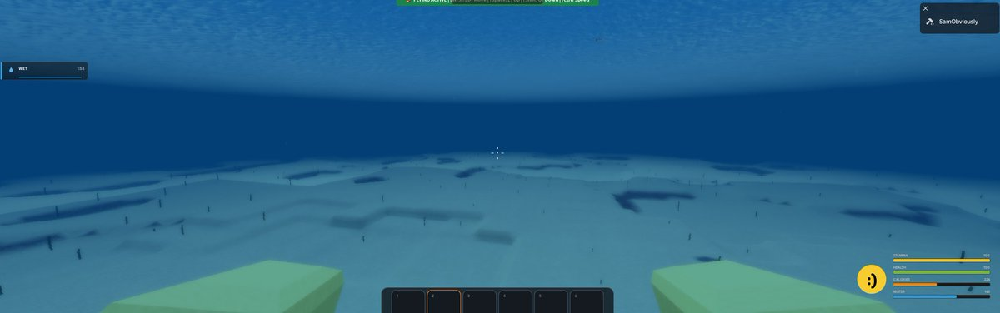
  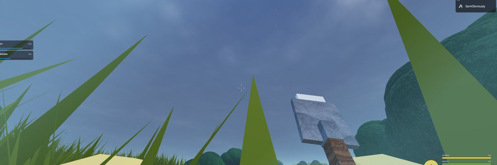

- **Key Updates:**
  - Engineered dynamic weather controller with smooth transitions
  - Added particle weather effects (rain, storms, overcast fog)
  - Polished deep cold ocean atmosphere and water shaders
- **Tags:** `#RobloxDev` `#WeatherSystem` `#Atmosphere` `#OceanBiome` `#GameDev`

---

## 🪸 Day 11 (Aug 25, 2026): Underwater Valley, Bioluminescent Corals & Vents

The deep ocean biome has been expanded with an underwater valley! 🪸🌊  
Populated with varied marine flora, bioluminescent glowing corals, and hydrothermal vents.

### 📸 Screenshots

  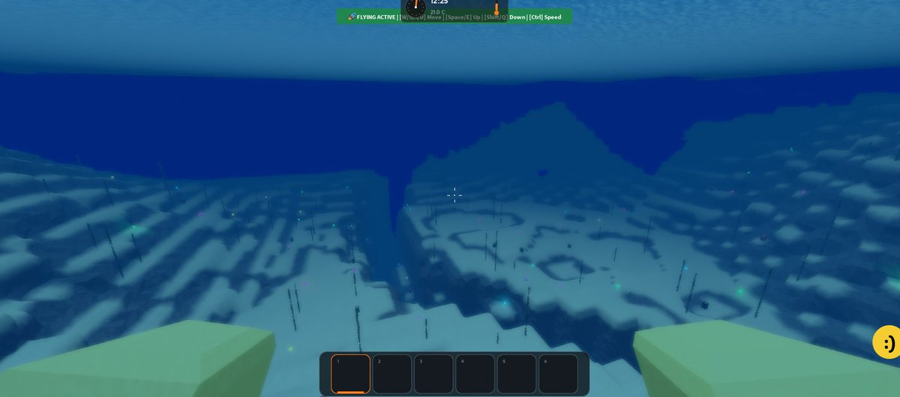
  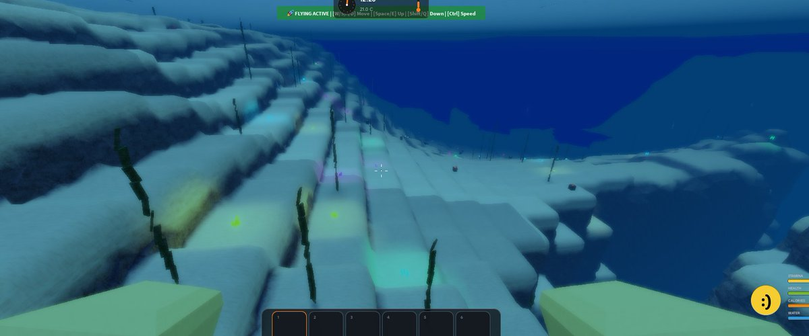

- **Key Updates:**
  - Sculpted dramatic underwater ocean trenches and valleys
  - Added custom bioluminescent glowing corals for atmospheric deep-sea lighting
  - Created hydrothermal volcanic vents with bubbling particle effects
- **Tags:** `#RobloxDev` `#OceanExpansion` `#Bioluminescence` `#Corals` `#GameDev`
