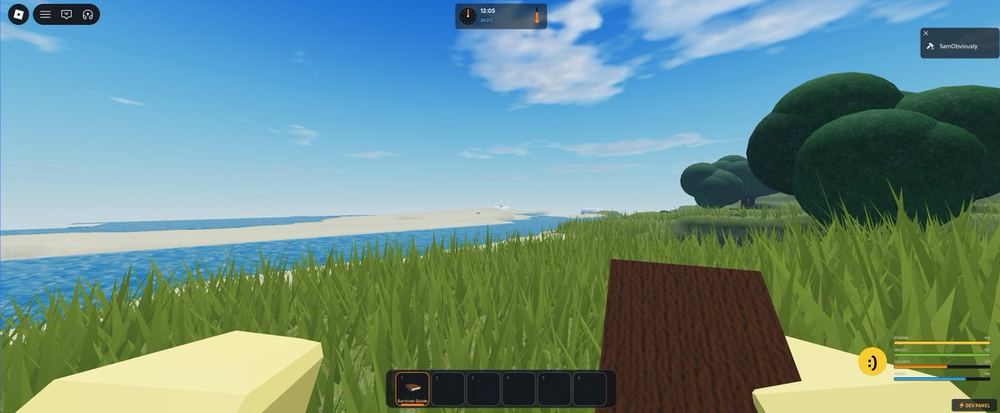
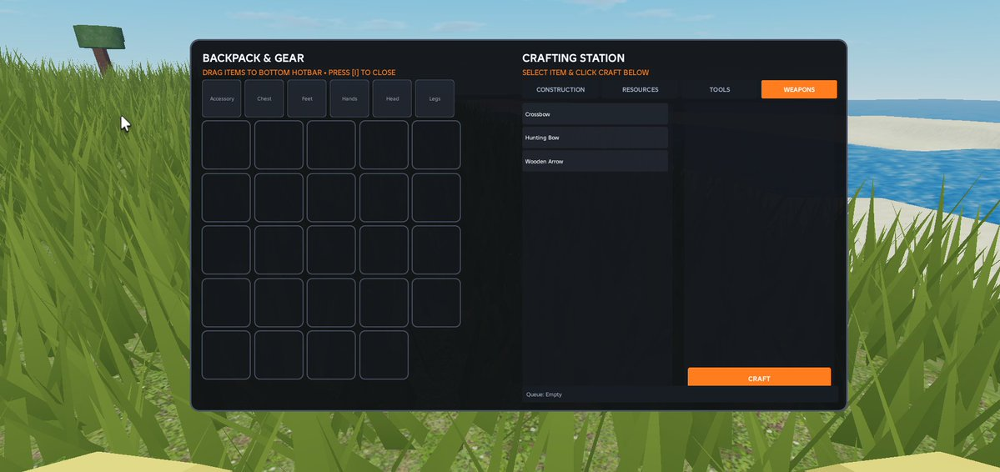
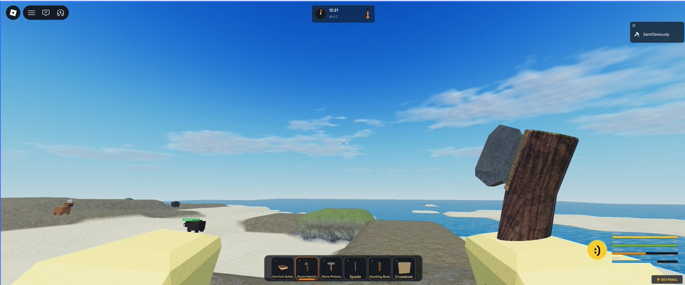
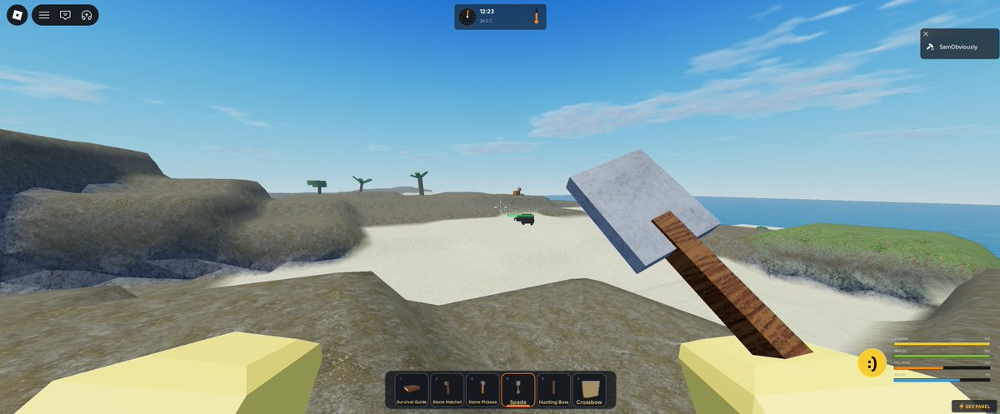
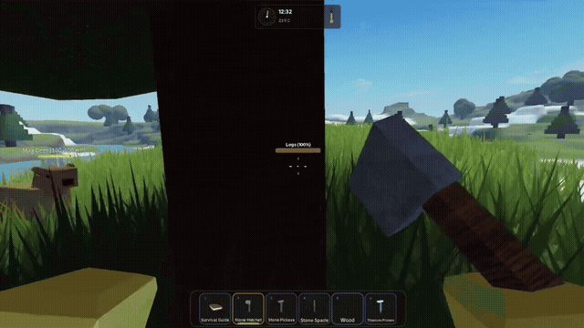
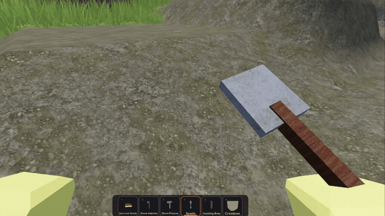
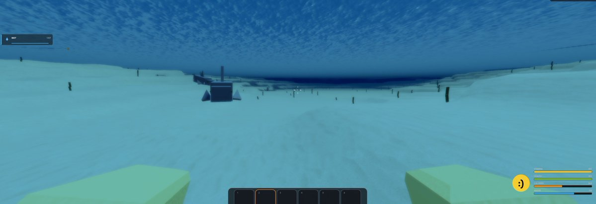
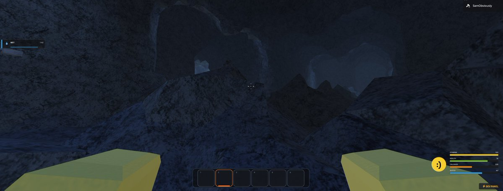

# 🎮 Roblox Survival Game - Dev Diary

> Documenting daily game progress, screenshots, and gameplay footage by **[@erdongsam](https://x.com/erdongsam)**.  
> 🌐 **Interactive Devlog Website**: [https://samobviously.github.io/RobloxGameDevelopment/](https://samobviously.github.io/RobloxGameDevelopment/)

---

## 🎮 Day 1 (Aug 15, 2026): Project Launch & Core Survival Systems

Day 1 of documenting my Roblox survival game! 🎮  
I'm already a few weeks into development, and I have completed the **GUI, animals/mobs, crafting mechanics, shovel, hotbar, and tools**.

### 📸 Screenshots

  
  

  
  

- **Key Updates:**
  - Designed custom survival GUI, health/hunger gauges, and HUD
  - Implemented inventory hotbar with quick-select tool slots
  - Added wild animals with roaming and detection mechanics
  - Created recipe-based Crafting system and tool interactions
- **Tags:** `#RobloxDev` `#ProjectLaunch` `#GUI` `#Hotbar` `#Animals` `#SurvivalGame`

---

## 🌲 Day 2 (Aug 16, 2026): Resource Gathering, Axes & Spades

Today was all about the resource grind! 🌲⚒️  
I just fully implemented **Axes and Spades**! Players will progress through 4 different crafting tiers for each weapon: **Stone, Copper, Iron, and Titanium** *(currently starting with Stone tier)*.

### 🎥 Gameplay Footage

  
  

- **Raw Video Files:**
  - 🪓 [Download Axe Tree Chopping Video (.mp4)](public/footage/day-2-axes-spades-harvesting.mp4)
  - ⛏️ [Download Spade Digging Video (.mp4)](public/footage/day-2-resource-tier-progression.mp4)
- **Key Updates:**
  - Implemented tree chopping and wood harvesting mechanics with Axes
  - Implemented terrain digging and resource gathering with Spades
  - Configured 4-tier crafting progression system (Stone, Copper, Iron, Titanium)
  - Added tool hit feedback, swinging animations, and particle effects
- **Tags:** `#RobloxDev` `#ResourceGrind` `#Crafting` `#Tools` `#Axes` `#Spades`

---

## 🌊 Day 3 (Aug 17, 2026): Deep Cold Ocean & Cave System

Expanding the map today! 🌊❄️  
I just finished implementing two brand-new biomes: the **Deep Cold Ocean** (complete with brand new mobs) and an **underground Cave system**.

### 📸 Screenshots

  
  

- **Key Updates:**
  - Implemented Deep Cold Ocean biome with custom underwater atmosphere and fog
  - Added brand new aquatic & cold-ocean mobs
  - Constructed subterranean underground Cave system for exploration
- **Tags:** `#RobloxDev` `#Biomes` `#CaveSystem` `#OceanBiome` `#Mobs`
